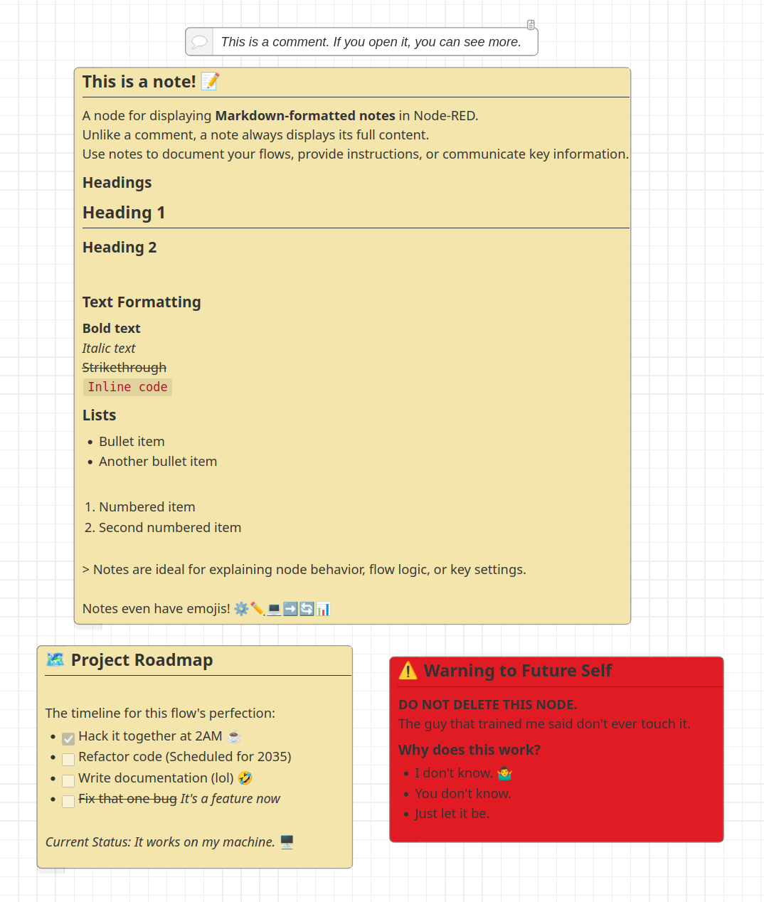

# Node-RED Markdown Note

[](https://www.npmjs.com/package/node-red-contrib-markdown-note)
[](https://www.npmjs.com/package/node-red-contrib-markdown-note)
[](LICENSE)

A Node-RED node for adding **Markdown-formatted notes** directly on the flow canvas.  
Designed for inline documentation, design notes, and contextual explanations that remain visible while editing or reviewing flows.



---

## Why use Markdown Note?

The standard Comment node hides content by default. Markdown Note keeps your notes **always visible**, making it easier to:

- Document flow logic inline  
- Highlight important information  
- Include structured content with headings, lists, and code blocks  

| Feature | Comment Node | Markdown Note |
|---------|-------------|---------------|
| Visibility | Collapsed by default | Always visible |
| Formatting | Plain text | Markdown (headers, lists, code, blockquotes) |
| Colors | Fixed editor style | Custom background and text colors |
| Structure | Minimal | Suitable for detailed documentation |

---

## Features

- **Always-visible notes** – No need to click to expand.  
- **Markdown rendering** – Support for headers, lists, emphasis, code blocks, quotes.  
- **Custom colors** – Choose the note background and text color from the node properties.
- **Task lists** – Track TODOs or action items inline.  
- **Resizable & readable layout** – Automatically adjusts to content size.  
- **Developer-focused** – Document payload formats, API contracts, assumptions, or edge cases directly on the flow.  

---

## Known Issues

- **Links are not clickable**: Due to Node-RED's security restrictions on SVG content in the flow editor, hyperlinks rendered in the markdown cannot be clicked.

---

## Installation

### Using the Palette Manager (recommended)

1. Open Node-RED in your browser
2. Go to **Menu** → **Manage palette** → **Install**
3. Search for `node-red-contrib-markdown-note`
4. Click **Install**

### Using npm

Run this in your Node-RED user directory (`~/.node-red`):

```bash
npm install node-red-contrib-markdown-note
```

Then restart Node-RED.

---

## Support

Markdown Note is free and open source.  
If it has helped you or saved you time, you can support continued maintenance here:

[GitHub Sponsors](https://github.com/sponsors/Backroads4Me)
